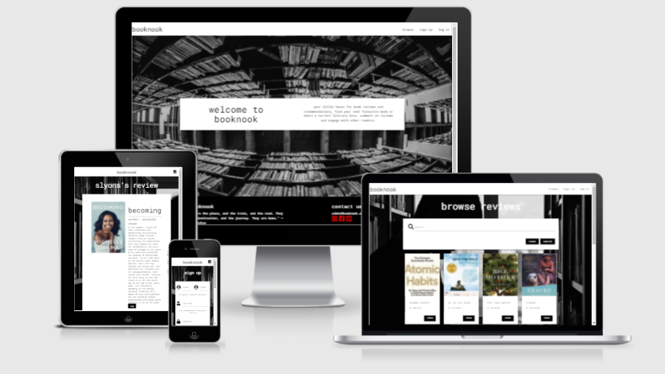
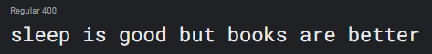
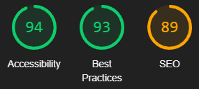

# 

Booknook is a web application developed as part of Code Institute, Diploma in Full Stack Software Development.
It is the third milestone project in a series of four projects.

The live site can be accessed [*here*](https://booknook-app.herokuapp.com/).

*Please note: To open any links in this document in a new browser tab, please press `CTRL + Click`.*

## Table of Contents
1. [Strategic Purpose Overview](#strategic-purpose-overview)
    * [Design Simulation](#design-simulation)
2. [User Experience Design](#user-experience-design)
   * [User Stories](#user-stories)
    *  [Design](#design)
        * [Scope and Structure](#scope-and-structure)
        * [Wireframes](#Wireframes)
        * [Database Structure](#database-structure)
        * [Security](#security)
        * [Color Scheme](#color-scheme)
        * [Typography](#typography)
        * [Imagery](#imagery)
        * [Design Limitations](#design-limitations)
        * [Design Differences from Conception](#design-differences-from-conception)
3. [Features](#features)
    * [Existing Features](#existing-features)
4. [Technologies](#technologies)
    * [Languages](#languages)
    * [Frameworks and Libraries](#frameworks-and-libraries)
    * [Programmes and Tools](#Programmes-and-tools)
    * [Sources](#sources)
5. [Testing](#testing)
    * [Code Validity](#code-validity)
    * [Testing Premise](#testing-premise)
    * [Bugs and Fixes](#bugs-and-fixes)
6. [Deployment](#deployment)
    * [Deployment via Heroku](#deployment-via-heroku)
    * [Make a clone on GitPod](#make-a-clone-on-gitpod)
7. [Credits](#credits)
    * [Images](#Images)
    * [Code](#Code)
    * [Acknowledgements](#Acknowledgements)

## Strategic Purpose Overview

Booknook is an online community where by non-members can view book recommendations and find links to where they can purchase these books. Members will be able to create, read, update and delete data they share via creating their own book reviews and commenting on other members reviews. This data will be searchable for all users. The site admin will in theory benefit from affiliated links they provide on their own reviews.

Booknook is a fully responsive fullstack frontend data driven application using MongoDB, Python, Materialize, Flask Framework, HTML, Javascript and CSS, based on the principles of UX design. The data will be stored in a non-relational database (MongoDB) and the site is hosted by Heroku, a cloud based hosting platform.

### Design Simulation

A simulation of the website on desktop and mobile devices can be seen below.

The live site can be accessed [*here*](https://booknook-app.herokuapp.com/).

*Please note: To open any links in this document in a new browser tab, please press `CTRL + Click`.*

## User Experience Design

### User Stories

#### Anonoumous User

| **As an anonoumous I would like to ** : |  **So that I can**  : |
| ------------- |:-------------:|
| easily understand the main purpose of the site | determine if it is what I need |
| use an aesthetically pleasing site| enjoy my user experience |
| easily navigate the site| quickly find what I need |
| find information is clearly presented | absorb it with minimal effort |
| have features load quickly | save time |
| view the site on different screen sizes| use it on a desktop or on the go |
| view/search book reviews and comments | find books to read |
| see links to purchase these books | easily purchase with minimal effort |

#### Registered User

A registered users goals are in addition to the above mentioned user goals.

| **As a registered user I would like to ** : |  **So that I can**  : |
| ------------- |:-------------:|
| upload my own reviews | share my recommendations with the community |
| add affiliated links to my reviews | potentially earn from my uploads |
| edit and delete content I have provided | manage my comments and reviews over time |
| login to a secure profile account | view and manage my uploads in one location |
| comment on others book reviews | so that I can interact and advise community members |

## Design

### Scope and Structure

**Scope**

* Responsive Design 
* Informative Landing Page
* Sticky top Nav Bar & Mobile Side Nav Bar 
* MongoDB database to store all uploaded data/content
* CRUD functionality through books and comments
* Login/Logout functionality
* Profile page
* Search functionality

**Skeleton**

This site will be made up of 8 different templates which will feed into a base template, creating what appears to be 8 seperate pages.
The pages will all have a 'sticky' top nav bar displaying menu items either in text or will be an icon with a slide out menu on mobile devices.
All pages will have a footer displaying copywrite information and social icons.

**Information Architecture**

The nav bar to an anon user will display a tab to search and an option to login/register, to a logged in user the search tab will display along side an 'add' tab (to add a book) and next to that a profile tab and logout tab.

The landing page will consist of a large hero image with a text introduction of the site's offering or purpose.

Login, registration, add/edit a book and add comment pages will all consist of forms with varying inputs dependant on the purpose of the form.

The profile page will display user information and book reviews they have uploaded. These reviews will display on cards with a button to edit

The search page will display a search bar and below that existing books will display on cards. Each card will have a link to view the review.

The review page will display a books title, image, author, link to purchase on a third party site and a short review. Below the book review a section holding comments left by registered users will be displayed on collapsable cards.

**Interaction Design**

The nav bar items will highlight on hover.

The user will be able to interact with the data on the search page by searching for a title, books will display below the search bar if found or a flash message with an error if not found.

All forms will protect against empty inputs and input format criteria where applicable with the user of colour and/or error messages.

Successful uploads and deletion of data will be conveyed to the user with flash messages.

### Wireframes
A mock-up of how the site will be laid out is available here via [Wire Frames](TBC).

### Database Structure

[Database Structure](TBA)

As shown in the link, the database structure is separated into 3 collections,

 > Users
 > Book Reviews
 > Comments

Users sign up with a name, email, password and username, this is saved in MongoDB with a unique identifier number or 'primary key'.

Book reviews hold book title, author, the review, the primary key of the review creator and are stored with a primary key. 

Comments hold the comment string, a date stamp (to help order the posts) the comment creator's primary key and the primary key of the book they commented on.

### Security

During development sensitive data, such as database configuration variables, were saved in an [env.py](https://pypi.org/project/env.py/) file. This file  is not uploaded to GitHub for security purposes. These details are stored on Heroku once the site has reached the deployment stage. 

### Color Scheme

The above color swatch shows a guideline for the color scheme of the site. 

Colors are brand colours that have been adopted for their strong visual contrast in an atempt to make all content as easily consumable and suitable for visually impared users as possible.

### Typography

The Roboto Mono font, created by *Christian Robertson* for [Google Fonts](https://fonts.google.com/specimen/Roboto+Mono#about) will be the main font for all headings
and content, in style 400 regular. 

### Imagery

Black and white imagery is used for hero and background images to keep inline with the theme of the app, images are from open sourced platforms. 

Book images are provided by open sourced http links of the images address. 

The logo was created using [canva.com](https://www.canva.com/). 

For a detailed list of image sources please see the [credits](#credits) section.

### Design Limitations

A future features I would like to incorrporate are:

>  * an option to update and edit user information, to reset forgotten passwords
>  * a totals table on the users profile page that shows total afffiliated links clicked by other users and possible revenue earned

### Design Differences from Conception

TBA

## Features

1. Responsive to different screen sizes.
2. Supported by Chrome, Microsoft Edge, and Firefox browsers.
3. Adapted for users with special accessibility requirements where possible.
4. There will be 11 pages: Home page, Search/Browse page, Profile page, Login page, Sign up page, Add/Edit Review page, Review Page, Add Comment page, 404 error and 500 error page.

        - Each page will have a navigation header
        - Each page will have a footer
        - Each page will have a favicon on the browser tab

5. Each page will have a 'sticky' navbar

        - White with black text
        - Text logo on the left, center on smaller screens
        - Menu options on the right
        - The logo will route back to the home page
        - Menu options will change to red on hover
        - On mobile devices, the menu items will switch to a toggle button and slide in from the right when button is clicked
        - The menu items will have the same styling in the toggle view
        - Anon users will see log in, sign up and browse
        - Registered users will see browse, add review, profile and logout

 6. The home page will have:

        - A hero image.
        - Informative text overlay on the hero image

7. The login/register page will have:

        - A form requesting user information and submission button

8. The profile page will have: 

        - An area displaying the users information
        - An area displaying books and comments the user has already added
        - There will be an option to edit/delete reviews, and a delete option for comments 

9. The add/edit page will have a form that has: 

        - blank fields for adding information
        - prepopulated fields for editing
        - a button which saves changes
        - a delete button that will remove the object from the site/database
        - a cancel button

10. The browse page will have a:

        - search bar allowing users to search by title
        - reset button to clear the last search
        - an error message for an unsuccessfull search
        - a section displaying existing books on cards
        - each book card will have a link to its review page

11. The review page will have:

    - a section displaying the book information and review
    - a section displaying users comments related to the displayed book
    - logged in members will see an option to delete their comments or to add a new comment

12. The add comments page will have:

    - a form to add a comment
    - a submission and cancel button

 ## Technologies

 ### Languages

 - [HTML5](https://www.w3schools.com/html/html_intro.asp)
 - [CSS3](https://www.w3schools.com/css/css_intro.asp)
 - [JavaScript](https://www.w3schools.com/js/js_intro.asp)
 - [Python](https://www.w3schools.com/python/python_intro.asp)

  ### Frameworks and Libraries

- [Flask](https://flask.palletsprojects.com/en/2.0.x/) functionality
- [Materialize](https://materializecss.com/) Styling and components
- [Font Awesome](https://fontawesome.com/v4.7.0/) Used for icons
- [Google Fonts](https://fonts.google.com/) Used to import fonts.

### Programmes and Tools

- [Balsamiq](https://balsamiq.com/) Used to create wireframes/mock-up during the planning & design process
- [Git Hub](https://github.com/about) Used to store, version control, and to share the project's code
- [Git/GitPod](https://www.gitpod.io/#:~:text=Gitpod%20is%20a%20multi%2Dservice,their%20own%20dedicated%20K8s%20deployment.) Code, build, debug and run K8s applications    entirely in the cloud.
- [Canva](https://www.canva.com/) For the creation of the logo
- [Adobe Color Wheel](https://color.adobe.com) Image gradient feature was used to extract colors used in the logo and build a colour scheme
- [Am I Responsive](http://ami.responsivedesign.is/) Used to check responsivity of code and display the mock-up in the documentation
- [Chrome Developer Tools](https://developers.google.com/web/tools/chrome-devtools) Used to test and optimize the site
- [Random Key Gen](https://randomkeygen.com/) to great random secret keys
- [Favicon Generator](https://www.favicon-generator.org/)

### Sources

_General sources of information for structure functionality and styling._

- [MDN Web Docs](https://developer.mozilla.org/)
- [W3 Schools](https://www.w3schools.com/js/default.asp)
- Code Institute, Full Stack Development course material.
- [Stack Over Flow](https://stackoverflow.com/)

## Testing

### Code Validity

The syntax and validity of the HTML and JavaScript code used were passed through the two validators mentioned below and passed all tests without errors.

1. [W3C](https://validator.w3.org/) used to validate HTML code.
2. [JS Hint](https://jshint.com/) used to validate JavaScript code.

The syntax and validity of the CSS code was passed throught the below validator and passed without error but did show warnings related to vendor prefixes.I have been advised by tutor support that this is fine for the submission of the MS3 and should not affect the outcome of the submission as it is unavoidable with the current version of this validator.

1. [W3c Jigsaw](https://jigsaw.w3.org/css-validator/) used to validate CSS code.

### Testing Premise

The entire site was tested under the three premises of :

        > User Stories
        > Business Objective
        > Features

Testing was done on three browsers; Chome v88, MicroSoft Edge v88 and FireFox v83 on the below screen sizes:

> **Chrome & Microsoft Edge**
> - Moto G4 (640 x 360)
> - Galaxy S5 (360 x 640)
> - Pixel 2 (411 x 731)
> - Pixel 2 XL (411 x 823)
> - iPhone 5/SE (320 x 568)
> - iPhone 6/7/8 (375 x 667)
> - iPhone 6/7/8 Plus (414 x 736)
> - iPhone X (375 x 812)
> - iPad (768 x 1024)
> - Surface Duo (540 x 720)
> - Galaxy Fold (280 x 653)
> - Laptop (1440 x 900)

> **Mozilla Fire Fox**
> - Galaxy Note 3 (360 x 640)
> - Galaxy Note 9 (414 x 846)
> - Galaxy S5 (360 x 640)
> - Galaxy S9 (360 x 740)
> - iPad (768 x 1024)
> - iPhone 5/SE (320 x 568)
> - iPhone 6/7/8 (375 x 667)
> - iPhone 6/7/8 Plus (414 x 736)
> - iPhone X/XS (375 x 812)
> - i Phone XR (414 x 896)
> - Laptop (1440 x 900)

Testing was documented using Microsoft Excel and the full spreadsheet can be found [*here*](testing/testing.xlsx).

The live site  was also analysed using Google Developer Tools Lighthouse feature, where it scored highly for accessibility, best practices and SEO.
The performance of the site scored in the median range despite all images being compressed and sized to the best of the developers ability. Further adjustments to improve this rating
are outside the scope of the assignment and the developers skill set at this time but will be researched and improved going forward.

Bugs found in the code and their fixes can also be found in the Excel document.

## Deployment

This application was created and controlled using GitHub and GitPod workspace.

A Code Institute template was used for the initial creation of this repository which can be found [here](https://github.com/Code-Institute-Org/gitpod-full-template).
To use this template to create a similar project simply click 'Use Template' at the top of the repository. You will be directed to name your own
repositry using this template. Once named, you can decide whether to make the 'repo' public or private, my version is public. Then select 'Create Repository'.
The 'repo' should then open and you can begin working on it by selecting the green GitPod button on the top right of the repo. The GitPod button will open your workspace.

### Deployment via Heroku

["Heroku is a container-based cloud Platform as a Service (PaaS). Developers use Heroku to deploy, manage, and scale modern apps"](https://www.heroku.com/about#:~:text=Heroku%20is%20a%20container%2Dbased,manage%2C%20and%20scale%20modern%20apps.&text=Heroku%20is%20fully%20managed%2C%20giving,servers%2C%20hardware%2C%20or%20infrastructure.) Before you deploy to Heroku you will need to add a requirements.txt file and a Procfile to your application. Heroku needs both of these files to run, they must be pushed to the repository on GitHub.

**To deploy your application to Heroku**

1. Go to [Heroku.com](https://id.heroku.com/login) and login or create and account.
2. Your dashboard should open and there will be a 'New' button on the top-right of the screen, select this.
3. Select 'Create New App' from the buttons drop down menu
4. Add your app name (it must be unique, lowercase with a dash used instead of spaces)
5. Select the region closest to you and click create app
6. You will then need to connect your GitHub Repository, in the deploy tab, under method, select "Connect to GitHub".
7. Connect your GitHub account, ensure the correct profile name is displayed
8. Then add your repository name, search and select the correct repository
9. Open the settings tab and select 'Reveal Config Vars'
10. You will need to add here, any secret or hidden variables that are not visable to Heroku from your GitHub repository.
    > * IP : "0.0.0.0"
    > * PORT : "5000"
    > * MONGO_DBNAME : "(Insert the database name you wish to connect to)"
    > * MONGO_URI : "(Insert URI)" - The URI can be found on MongoDB under Clusters, "Connect" > "Connect your application" 
    and replacing the generic values with your user name and password
    > * SECRET_KEY : "(Insert custom secret key you created in configuration to keep the sessions secure)
11. Hide Con Fig Vars and reopen the deploy tab
12. Under automatic deployment enable automatic deployment
13. In manual deploy section select the branch you wish to deploy from the drop down and click deploy branch
14. This will take a few moments, once complete and option to view the live app will appear

### Make a clone on GitPod

1. Select the Repo you wish to clone in GitHub
2. Click on the code dropdown button
3. Copy the https link to your clipboard
4. Open your gitpod workspace
5. In the terminal type "git clone" and paste the copied link
6. Hit enter to create the clone
7. To install the required packages type pip install -r requirements.txt into the command line
8. To view what the code will look like in a browser from here type "python3 app.py" into the console and hit enter or replace "app.py" with which ever you have named the app
9. A pop-up will appear stating "A service is available on Port 8080" select Open Browser

## Credits

### Images

1. Hero Image by [Luis Tosta](https://unsplash.com/@luis_tosta) from [unsplash.com](https://unsplash.com)
2. Background image by [Pixabay](https://www.pexels.com/@pixabay) from [pexels.com](https://www.pexels.com)

### Code
1. Error Handels 404 and 505 [Flask Documentaion](https://flask.palletsprojects.com/en/1.1.x/patterns/errorpages/)
2. Scroll to top button, Java Script [w3schools](https://www.w3schools.com/howto/howto_js_scroll_to_top.asp)
3. 